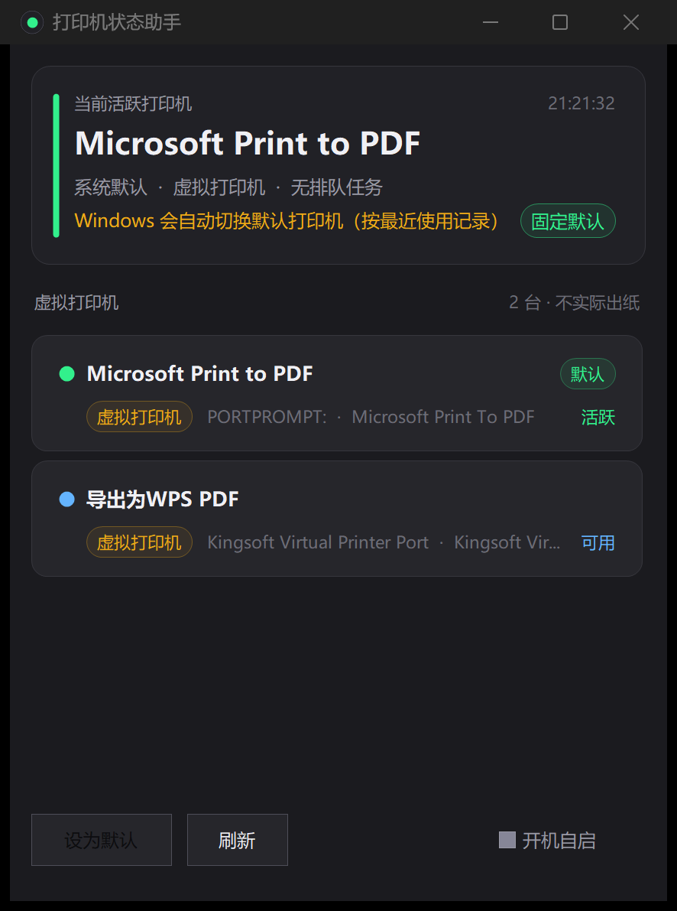

# 打印机状态助手（PrinterMonitor）

Windows 11 桌面小工具：一眼看清所有打印机的实时状态。托盘常驻、单击即开，不必再为了"打印机到底连没连上"翻系统设置。



## 功能

- **实时状态一览**：列出系统中所有打印机，显示在线/离线、报错原因（缺纸、卡纸、缺墨、门未关等）以及排队/打印中的任务数
- **默认打印机重点提示**：绿色 = 系统默认且在线（WPS、浏览器等实际会用的那台）；黄色 = 系统默认但已离线，一眼定位"为什么打不出纸"
- **默认打印机不再乱跳**：检测 Windows 的「让 Windows 管理默认打印机」设置，若处于开启状态则在顶部提示，点「固定默认」即可关闭（托盘菜单里也有同一项）。这正是"WPS 里默认设备老是变"的根源——该设置会把默认打印机自动切换成你最近用过的那台
- **一键切换默认打印机**：选中卡片后点「设为默认」，或右键卡片选择菜单项，切换后托盘提示同步更新
- **虚拟打印机识别**：Microsoft Print to PDF / XPS / Fax 等单独归组，并提示"只会生成文件，不会实际出纸"
- **智能排序**：实体设备优先 → 可用优先 → 默认优先 → 任务数 → 名称
- **完整信息悬浮提示**：名称过长被截断时，鼠标悬停可看到全名、端口、驱动与状态
- **托盘常驻**：单击或双击托盘图标开窗；托盘悬停显示当前默认打印机；菜单含显示主窗口 / 立即刷新 / 固定默认打印机 / 开机自启 / 退出
- **自动刷新**：窗口可见时每 3 秒扫描一次，隐藏到托盘后降为每 10 秒；内容无变化时跳过重绘
- **快捷键**：`F5` 立即刷新，`Esc` 隐藏到托盘
- **高分屏适配**：声明系统 DPI 感知，初始化时按系统 DPI 换算全部尺寸与字号（本机 4K@200% 下实测按 2 倍布局，文字锐利）；深色主题
- **零依赖免安装**：产物为单个 exe，无需安装 .NET SDK 或任何运行库，也不依赖 WMI 服务

## 运行环境

- Windows 10 / 11，依赖系统自带的 .NET Framework 4.x，无需额外安装
- 编译同样只需系统自带的 C# 编译器（`build.bat` 会自动定位）

## 快速开始

```bat
git clone https://github.com/partpull/PrinterMonitor.git
cd PrinterMonitor
build.bat
```

`build.bat` 编译完成后生成 `PrinterMonitor.exe`，双击即可运行。

想让程序开机后安静地待在托盘里，勾选界面下方的「开机自启」（或托盘菜单里的同名项）。该选项写入注册表 `HKCU\Software\Microsoft\Windows\CurrentVersion\Run`，并以 `/tray` 参数启动。

### 命令行参数

| 参数 | 说明 |
| --- | --- |
| `/tray` | 启动后直接缩到托盘，不弹出窗口（开机自启时使用） |

## 状态灯对照

| 颜色 | 状态 | 含义 |
| --- | --- | --- |
| 绿色 | 活跃 | 系统默认打印机，且在线——打印任务会走这台 |
| 黄色 | 默认已离线 | 系统默认打印机，但当前离线，需要优先处理 |
| 蓝色 | 可用 | 非默认打印机，在线可用 |
| 红色 | 异常 | 缺纸 / 卡纸 / 缺墨 / 门未关等报错 |
| 灰色 | 离线 | 离线或不可用 |

## 工作原理

全部通过 `winspool.drv` 的 spooler API 完成，**不使用 WMI**（因此不依赖 WMI 服务，在被管控的机器上也能正常工作）：

| 用途 | 做法 |
| --- | --- |
| 打印机列表 | `EnumPrinters`（Level 2）取得名称、端口、驱动、服务器、属性位与状态位 |
| 排队任务数 | `OpenPrinter` + `EnumJobs` 逐台统计 |
| 离线标记 | 属性位 `PRINTER_ATTRIBUTE_WORK_OFFLINE`，或状态位 `PRINTER_STATUS_OFFLINE` / `NOT_AVAILABLE` / `SERVER_UNKNOWN` |
| 报错原因 | 状态位 `PRINTER_STATUS_*`：缺纸、缺墨、卡纸、门未关、需人工干预、出纸槽已满、内存不足等 |
| 默认打印机 | 优先读注册表 `HKCU\Software\Microsoft\Windows NT\CurrentVersion\Windows\Device`（实测 0.016 ms，而单次 `GetDefaultPrinter` 调用约 7 ms，且两者结果完全同步），取不到或指向已卸载设备时退回 `GetDefaultPrinter` |
| 切换默认打印机 | `SetDefaultPrinter` |
| 自动管理默认打印机 | 读取 / 写入 `HKCU\...\Windows\LegacyDefaultPrinterMode`（`0` = 让 Windows 自动切换，`1` = 固定为用户所选） |

两点实现上的取舍：

- **不读 `PRINTER_INFO_2.Attributes` 的 DEFAULT 位**。实测在 Windows 11 上该位经常不设置：本机 `Microsoft Print to PDF` 明明是默认打印机（`GetDefaultPrinter` 与注册表都确认），但它的 `Attributes` 是 `0x240`，第 3 位为 0。若按该位判断会导致默认打印机识别静默失效。
- **状态判定以「能否出纸」为准**：缺纸、卡纸、开盖、需人工干预等会影响出纸的状态标红「异常」。墨量低（`PRINTER_STATUS_TONER_LOW`）时仍能正常出纸，因此不计入「异常」（当前版本也不单独展示该提示）。

扫描性能（本机 2 台打印机实测）：spooler 约 **1.35 ms**，同样内容的 WMI 查询约 57.7 ms，快约 42 倍。

程序不联网，不上传任何数据。遇到未处理异常时会写入 `%LOCALAPPDATA%\PrinterMonitor\log.txt` 便于排查，平时不产生文件。

## 项目结构

| 文件 | 说明 |
| --- | --- |
| `Program.cs` | 程序入口：单实例互斥、DPI 缩放初始化、`/tray` 参数解析、开机自启与「自动管理默认打印机」的注册表读写、异常日志、运行期绘制应用图标 |
| `MainForm.cs` | 主窗口：卡片列表布局、托盘图标与菜单、定时刷新、变更检测、快捷键、设为默认 / 固定默认交互 |
| `PrinterService.cs` | 打印机扫描与状态判定：spooler API 调用、任务计数、虚拟打印机识别、状态归并、排序 |
| `Controls.cs` | 自绘控件：顶部状态区（含「固定默认」按钮）、打印机卡片、分组标题、状态灯 |
| `Theme.cs` | 深色主题配色、状态灯颜色、字号与 DPI 缩放换算 |
| `app.manifest` | 应用清单：DPI 感知、Windows 7–11 兼容声明、以普通用户权限运行 |
| `build.bat` | 一键编译脚本，调用系统自带 `csc.exe` 生成单个 exe |